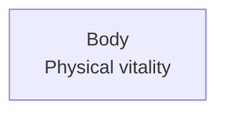

# Line Breaks in Mermaid Node Labels

Version: 0.1.0
Status: Draft
Style Guide: style-guide--plain-language-for-general-audiences

## Abstract

This is a short reference on how to put a node label on more than one line in a Mermaid flowchart, and on why the same label can wrap in one renderer and stay on a single line in another. It is a companion to *Style Guide: Markdown Mermaid Navigation Flowcharts and Linked Sections*. It shows three ways to break a label, each with its source and a rendered example, so you can see what your own renderer does.

## Why the same label can render two ways

Mermaid draws a node label by turning it into HTML or SVG text, depending on the `htmlLabels` setting and the Mermaid version (<a name="apa-mermaid-docs-citation"></a>[Mermaid, n.d.](#apa-mermaid-docs-reference)). That is why a line break is not one fixed rule. A break that one renderer honors, another may collapse into a single space, the same way a web browser collapses whitespace in HTML. The reliable way to know what a label will do is to render it where you publish.

## Three ways to break a label

Each method below shows the Mermaid source first, then a rendered chart. Open this document in the renderer you care about and compare the boxes.

### A raw newline in the source

Put the second line on its own line inside the quotes. This keeps the source free of HTML.

Source:

````code

````

Rendered:


### A break tag

Insert an HTML break token, `<br/>`. This is the long-standing method and the most widely supported across renderers and versions.

Source:

````code

````

Rendered:


### A markdown string with a newline

Wrap the label in backticks and start a new line. This is the documented way to break a line without HTML. It also wraps long text automatically and supports bold and italic.

Source:

````code

````

Rendered:


## Which one to use

- If you control the renderer and have confirmed the result, a raw newline is fine and keeps the source clean.
- The `<br/>` tag is the safest choice across many renderers and Mermaid versions.
- A markdown string, in backticks, is the documented HTML-free option, and it adds auto-wrapping and simple formatting.

Whatever you choose, confirm it where you publish. GitHub pins its own Mermaid build and renders with a strict security level, so a label that breaks in a local preview can behave differently there.

## Test it yourself

Save the file below as `mermaid-linebreak-test.html` and open it in a browser. It loads the real Mermaid engine from a CDN and renders all three methods side by side, so you can see which ones break for that engine.

```html
<!DOCTYPE html>
<html lang="en">
<head>
<meta charset="utf-8">
<title>Mermaid line-break test</title>
</head>
<body>
<h2>1. Raw newline</h2>
<pre class="mermaid">flowchart TD
    A["Body
    Physical vitality"]</pre>

<h2>2. Break tag</h2>
<pre class="mermaid">flowchart TD
    B["Body<br/>Physical vitality"]</pre>

<h2>3. Markdown string</h2>
<pre class="mermaid">flowchart TD
    C["`Body
    Physical vitality`"]</pre>

<script type="module">
  import mermaid from 'https://cdn.jsdelivr.net/npm/mermaid@11/dist/mermaid.esm.min.mjs';
  mermaid.initialize({ startOnLoad: true });
</script>
</body>
</html>
```

## License

This document, *Line Breaks in Mermaid Node Labels*, by **Christopher Steel**, with AI assistance from **Claude (Anthropic)**, is licensed under the [GNU Affero General Public License v3.0 or later](https://www.gnu.org/licenses/agpl-3.0.html).

## Resources

### Diagram syntax

- [Mermaid flowchart syntax](#apa-mermaid-docs-reference)

## References

<a name="apa-mermaid-docs-reference"></a>Mermaid. (n.d.). *Flowchart syntax*. Retrieved August 8, 2026, from https://mermaid.js.org/syntax/flowchart.html
[Return to citation](#apa-mermaid-docs-citation)

## Changelog

| Version | Status | Notes |
|---------|--------|-------|
| 0.1.0 | Draft | Initial draft; records the three ways to break a Mermaid node label, with rendered examples and a self-contained test page, as a companion to the navigation-flowchart style guide |
