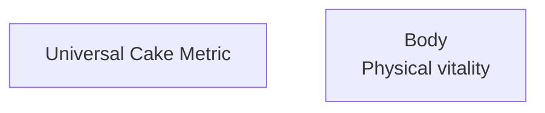
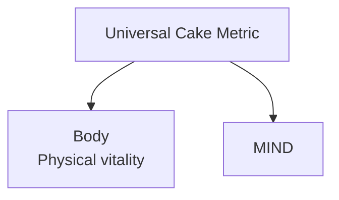
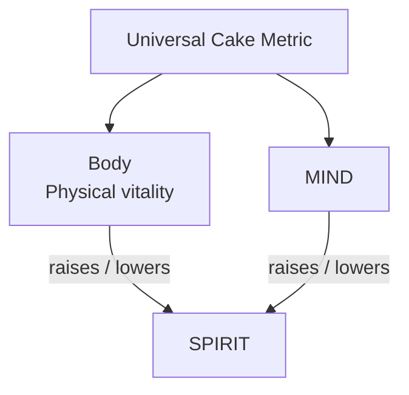
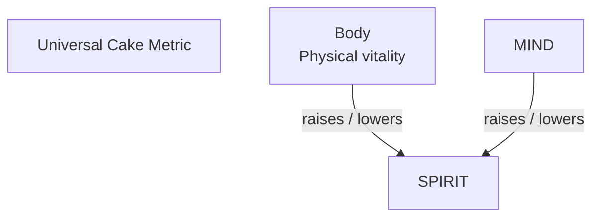
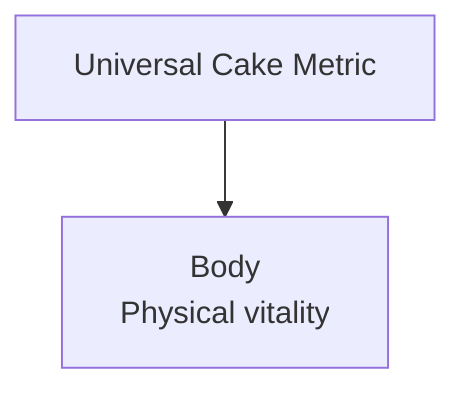
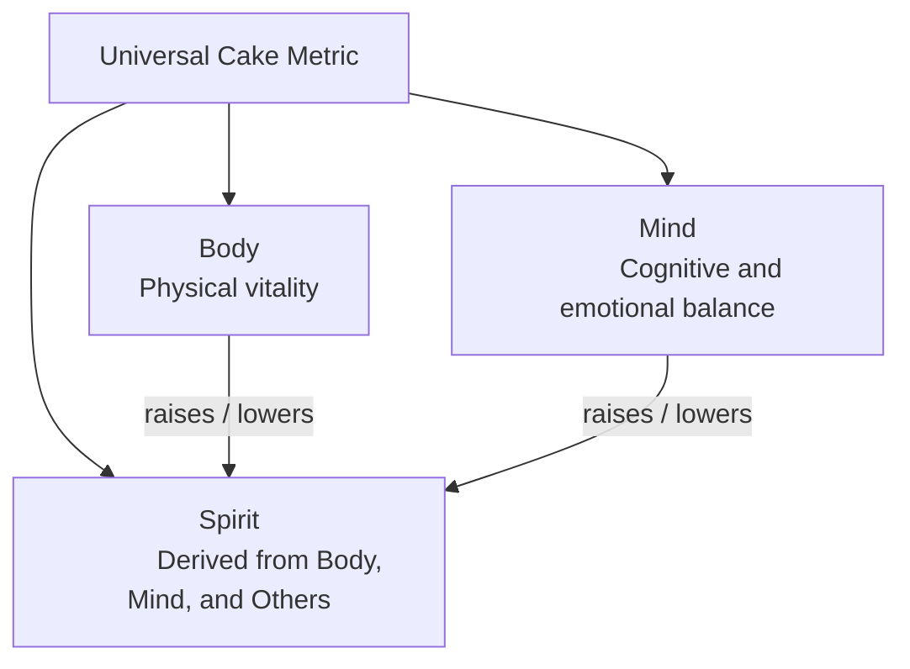

# Style Guide: Markdown Mermaid Navigation Flowcharts and Linked Sections

Version: 0.1.1
Status: Draft
Style Guide: style-guide--plain-language-for-general-audiences

## Abstract

This guide describes one pattern. A flowchart sits near the top of a page and works as a clickable map. Each box in the chart links to an H2, H3, H4, H5 or H6 section further down the same page with the same name.

In the linked H2, H3, H4, H5 or H6 section a link that returns the user back to the chart anchor is created.

This guide explains how to build it so every version looks and behaves the same way.

For document structure, filenames, frontmatter, and closing sections, this guide defers to *Style Guide: Versioned Documents in Unrendered Markdown*, which is authoritative across this repository. For heading semantics and screen-reader access, it builds on *Style Guide: Navigation and Accessibility*. For markdown details it touches, headings, em dashes, horizontal rules, and citations, it defers to the markdown automa in `automa/markdown/defaults/`. This guide governs one thing: the shape of a navigation flowchart and the sections it links to and the return links back to the charts anchor.

## A few terms first

A few words are used throughout, so here is what each one means.

Mermaid is a tool that turns plain text into a diagram (<a name="apa-mermaid-docs-citation"></a>[Mermaid, n.d.](#apa-mermaid-docs-reference)). You write the diagram as text inside a fenced code block marked `mermaid`, and the renderer draws it.

### Edge

In Mermaid diagrams, an **edge** is the **arrow/connection that links two nodes**, not the boundary of a node itself.

This follows standard **graph theory terminology**:

| Term     | What It Is                                    | Mermaid Example      |
| -------- | --------------------------------------------- | -------------------- |
| **Node** | A vertex/shape in the diagram                 | `[A]`, `(B)`, `{C}`  |
| **Edge** | The directed or undirected link between nodes | `-->`, `---`, `<-->` |

**Example flowchart:**

```
A --> B
```

Here:

- `A` and `B` are **nodes**
- `-->` is the **edge** connecting them

Mermaid supports various edge types:

- `-->` — directional arrow
- `---` — undirected line
- `<-->` — bidirectional arrow
- `-.->` — dashed directional edge
- `==>` — thick directional edge

So "edge" in Mermaid = the connector/relationship between nodes, consistent with how it's used in graph databases, network diagrams, and general graph theory.

### Node

A node is a box in the chart. An edge is an arrow between two boxes.

### Anchor

An anchor is a named spot on the page that a link can point to. A link to an anchor looks like `#the-name`.

A slug is a short, lowercase, hyphen-separated name, such as `other-humans`.

The Markdown renderer auto-generates an anchor for every heading. It builds the slug from the heading text by lowercasing it, replacing spaces with hyphens, and dropping punctuation. So this heading:

markdown

```markdown
## Other Humans
```

becomes the anchor `#other-humans` on the rendered page, with no extra markup from you.

A Mermaid chart can reference these auto-generated anchors. A `click` line that points at the slug sends the reader to that heading:

text

```text
click HUMANS "#other-humans" "Jump to Other Humans"
```

If you want a target that stays fixed even when the heading text changes, you can add an explicit anchor with embedded HTML, `<a name="other-humans"></a>`, directly under the heading. The chart references the same slug either way.

### Tooltip

A tooltip is the small text that appears when a reader hovers over a clickable box. It also acts as a label for assistive technology.

## When to use this pattern

Use it when a document has one parent idea and several parts, and a reader benefits from seeing the parts as a picture before reading them in order. The chart gives a map. The links let a reader jump straight to the part they want to know more about. The return links let them come back to the map without scrolling.

Do not use it for a diagram that only illustrates a flow and has no matching  sections. If the boxes do not each lead to a section, the diagram is a plain illustration, not a navigation chart, and this guide does not apply.

## The three parts

A navigation flowchart has three parts, and they must agree with each other:

- A chart, with one clickable box for each section, and its own anchor so the sections can have links that return the user back to the chart.
- A set of sections, one for each box, each with an anchor that its box links to.
- A return link at the end of each section that points back to the chart.

The next sections describe each part. The last section shows them together.

## The chart

### Start with a top-down flowchart

Begin the chart with `flowchart TD`. `TD` means top-down, so the parent idea sits at the top and its parts flow downward. Use top-down by default, because it matches how the sections are read, from top to bottom. 

When a chart is wide and shallow it may read more clearly sideways, In these cases a left-to-right (`flowchart LR`) is can be used.

### Name nodes with short uppercase ids

Give each node a short, uppercase id, such as `UCM` or `BODY`. The id is the internal name. It never appears to the reader. The text a reader sees is the label, written in quotes after the id.

Example of the Mermaid code in a Markdown file:

````code

````

Rendered as a Mermaid chart in a Markdown document:


### Keep labels short and readable in two places

A label should read well both on the drawn chart and in the plain text source. Keep it to a short name, and add a brief description on a second line when it helps.

Never use html in a chart if it is not requires so:

* Do not use `<br/>` to break a label onto a second line.
* Do not use the escaped characters `\n` in a label.

Instead of using `\n` or `<br/>` ,  you can place the text you want on the second line in the node directly on the second line in the chart code and align it with the text on the preceding line like this: 

```code
    BODY["Body
          Physical vitality"]
```

### Use two kinds of edge

There are two kinds of arrow, and each says something different.

A plain arrow shows that one box belongs to or leads/points to another.

Example of the Mermaid code in a Markdown file:

````code

````

Rendered results:


A labeled arrow names the relationship. Add a label only when the relationship needs a name.

````code

````

Example:



Group the plain arrows together, then the labeled arrows, so the source stays easy to read.

### Make every box clickable chart

Give every box a `click` line. The `click` line has three parts: the node id, the link target, and a tooltip.

Here we make the Body 

Mermaid code example:

````code

````

Rendered:


Point the target at a same-page section with `#` and the section slug. To point at another document, use the file name, and add `#` and a slug to reach a section inside it.

Example of click targets in a Markdown file:

````code
```mermaid
    click BODY "#body" "Jump to Body"
    click UCM "overview.md" "Framework overview"
```
````

Always include the tooltip. It tells a reader where the box leads, and it gives assistive technology a label for the box.

### Give the chart its own anchor

Put an anchor on the line directly above the chart. The sections link back to this anchor. Name it after the document or the chart, and end it with `-chart`.

Example of the anchor and chart in a Markdown file:

````code
<a name="universal-cake-metric-chart"></a>


````

Rendered as a Mermaid chart in a Markdown document:


### Leave the defaults alone

Do not set `securityLevel` in the chart unless something genuinely requires it. Do not place a horizontal rule above or below the chart to fence it off. Horizontal rules are not used in this repository (see *Markdown: No Horizontal Rules*). Blank lines separate the chart from the text around it.

## The linked sections

### One box, one section

Every box links to exactly one section, and every section has exactly one box. Nothing in the chart should lead nowhere, and no linked section should be missing from the chart.

### Match the heading to the box

Write the section heading so it matches the box label. If the box says `Body`, the heading is `## Body`. A reader who clicks a box should land on a heading that clearly reads as the place they meant to reach.

Use a real heading (`##`, `###`) for every section. Never use bold text as a stand-in for a heading. Bold text is not a heading to a screen reader, and it cannot be linked to. This is the rule set out in *Style Guide: Navigation and Accessibility*.

### Give each chart an anchor that matches its title

Put an anchor directly under the heading. Its slug is the lowercase, hyphen-separated form of the heading. This slug is the target the box links to.

```markdown
## Other Humans
<a name="other-humans"></a>
```

An explicit anchor is used because it is exact. It keeps working even if a renderer forms its automatic heading ids differently, and the box's `click` target lands on the same slug every time.

### Follow one shape inside each section

Keep the sections parallel. A reader learns the shape once and then reads the rest quickly. Use this shape:

- A short opening sentence that defines the part in plain language.
- An optional paragraph that adds detail.
- An optional labeled list of specifics, introduced by a short label such as `Includes:` or `Potential metrics:`.

Pick one list label for a given document and use it in every section. Do not alternate between labels.

### Turn nested boxes into nested headings

When a box sits under another box in the chart, its section sits under the parent's section as a deeper heading. If `Others` is a `##` section and `Other Humans` is a box beneath it, then `Other Humans` is a `###` section inside `Others`. The heading depth mirrors the chart.

### End each section with a return link

Finish every section with a link back to the chart anchor. This lets a reader return to the map without scrolling.

```markdown
[Return to the chart](#dimensions-chart)
```

## Keep the parts in sync

The pattern works only when the chart, the sections, and the links all agree. Before you publish, check each item:

- Every box has a `click` line with a tooltip.
- Every `click` target has a matching section anchor on the page.
- Every section that appears in the chart is present, and every section present is in the chart.
- Each box label, its section heading, and its anchor slug all correspond.
- The chart has its own anchor, and every section links back to it.
- Nested boxes have matching nested heading depths.
- The chart sets no `securityLevel`, uses no escaped `\n`, and has no horizontal rules around it.

## A complete example

This example shows a trimmed version of the framework chart with two sections and their return links. It follows every rule above.

````markdown
<a name="flowchart-illustrating-universal-cake-metrics"></a>



## Body
<a name="body"></a>

Physical vitality, the state of the physical organism, including health, energy, and embodied capacity.

Potential metrics:

- Effects on sleep, energy, and mobility
- Exposure to toxins or restorative elements

[Return to the chart](#dimensions-chart)

## Mind
<a name="mind"></a>

Cognitive and emotional balance, including clarity, regulation, and resilience.

Potential metrics:

- Cognitive load, raised or reduced
- Emotional regulation, supported or disrupted

[Return to the chart](#dimensions-chart)
````

Rendered as a Mermaid chart in a Markdown document:

<a name="rendered-flowchart-illustrating-universal-cake-metrics"></a>


## Accessibility notes

This pattern depends on real headings and clear labels, so a few points are worth stating plainly.

Every section boundary is a real heading, never bold text. A screen reader builds its section-by-section outline from headings, and bold text does not appear in that outline. *Style Guide: Navigation and Accessibility* explains this in full.

Every box carries a tooltip on its `click` line. The tooltip is the label assistive technology reads for that box, so a box without one is a box a screen reader cannot describe.

Every link points at an explicit anchor. Explicit anchors do not depend on how a renderer builds automatic heading ids, so the links stay reliable across the tools this repository publishes with.

## License

This document, *Style Guide: Markdown Mermaid Navigation Flowcharts and Linked Sections*, by **Christopher Steel**, with AI assistance from **Claude (Anthropic)**, is licensed under the [GNU Affero General Public License v3.0 or later](https://www.gnu.org/licenses/agpl-3.0.html).

## Resources

### Chart Example Resources

These short entries exist only so the rendered example charts above have working targets to jump to. Each one links back to the example it serves.

#### Universal Cake Metric

Here what the Universal Cake Metric node represents is describe. The Universal Cake Metrics are used to evaluate products, services, ideas, approaches and practices for applications in situations when you want to create highly accessible and healthy products for as many people as possible by evaluating the item for supporting high quality relationships with the Mind, with your Body and with Others.

[Return to the "Rendered Flowchart Illustrating Universal Cake Metrics"](#rendered-flowchart-illustrating-universal-cake-metrics)

#### Body

Body refers to the quality of your relationship with your physical being

[Return to the "Rendered Flowchart Illustrating Universal Cake Metrics"](#rendered-flowchart-illustrating-universal-cake-metrics)

#### Mind

Body refers to the quality of your relationship with your mind being

[Return to the "Rendered Flowchart Illustrating Universal Cake Metrics"](#rendered-flowchart-illustrating-universal-cake-metrics)

#### Others

Others refers to the quality of your relationship with other humans including friends, families, organizations and communites

Other also refers the the quality of your relationship with the natural world and all of the living things in it.

[Return to the "Rendered Flowchart Illustrating Universal Cake Metrics"](#rendered-flowchart-illustrating-universal-cake-metrics)

#### Spirit

Is the way you feel as a result of the quality of all three of these relations with with self (mind and body) and with Others (People, Environment, Animals, Plants...). When you engage in activities that strengthen your relationships with self and others then Spirit follows. The same goes when you engage in activities that are harmful to the quality of your relationships with your mind, body and others.

[Return to the "Rendered Flowchart Illustrating Universal Cake Metrics"](#rendered-flowchart-illustrating-universal-cake-metrics)

### Diagram syntax

- [Mermaid flowchart syntax](#apa-mermaid-docs-reference)

## References

<a name="apa-mermaid-docs-reference"></a>Mermaid. (n.d.). *Flowchart syntax*. Retrieved August 8, 2026, from https://mermaid.js.org/syntax/flowchart.html
[Return to citation](#apa-mermaid-docs-citation)

## Changelog

| Version | Status | Notes |
|---------|--------|-------|
| 0.1.1 | Draft | Reformatted chart examples to show the Mermaid source then a rendered chart; reworked the chart-anchor and complete examples; converted the click-target snippet to a source-only block to avoid a parse error; added a Chart Example Resources group with working targets and return links; renamed to the markdown-mermaid identifier and bumped the version |
| 0.1.0 | Draft | Initial draft; codifies the clickable navigation flowchart pattern from framework/dimensions.md and the shape of the sections it links to |
