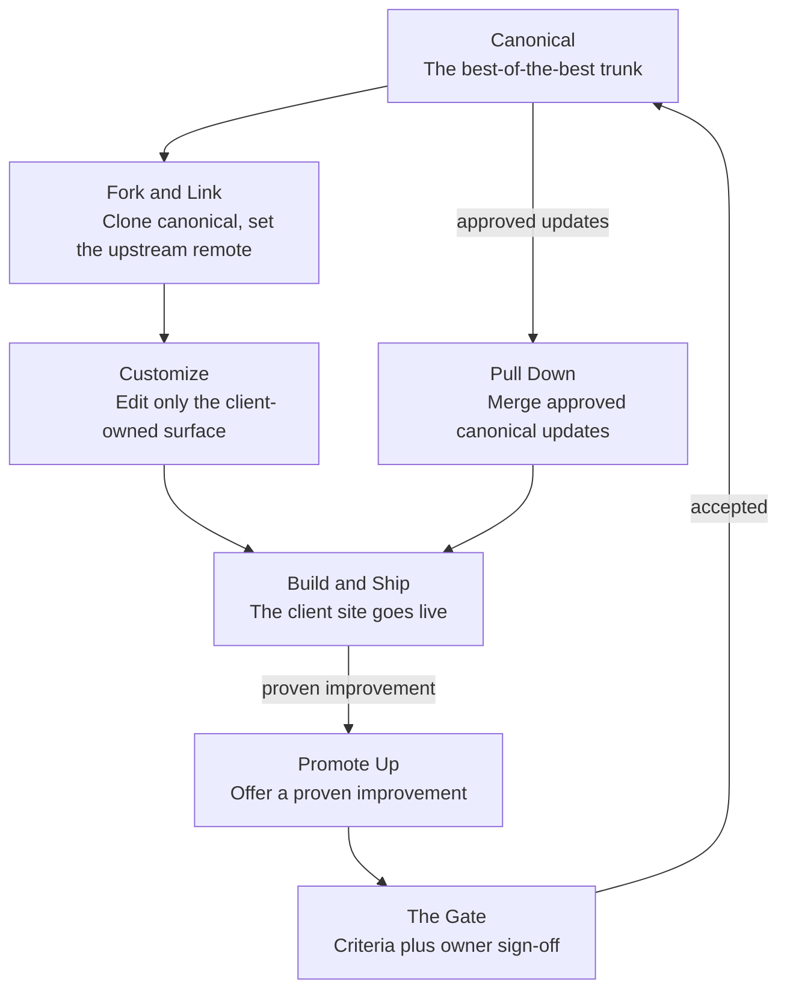

# The Canonical Loop: Forking, Customizing, and Promoting Client Sites

Version: 0.1.1
Status: Draft
Style Guide: style-guide--markdown-mermaid-navigation-flowcharts-and-linked-sections

## Abstract

This document describes one process. A single canonical repository holds the best-of-the-best version of the site template. Every client site is a fork of that trunk, customized only where it is meant to be customized, and kept current by pulling approved updates back down from canonical. When a client project produces a genuinely better solution, that improvement is promoted back up into canonical, but only after it clears a review gate.

The process is a loop with two directions of flow. Updates travel *down*, from canonical to every client, routinely and with little ceremony. Improvements travel *up*, from a single client back to canonical, deliberately and through a gate. The down-flow keeps clients current; the gated up-flow is what keeps canonical worthy of the name.

The map below is clickable. Each box leads to the stage that describes it, and each stage returns to the map. This document follows *Style Guide: Markdown Mermaid Navigation Flowcharts and Linked Sections* for that pattern.

## The map

The flowchart is the whole process at a glance. Read it clockwise from the top: canonical is forked into a client, the client is customized and shipped, canonical updates flow down into the client, and a proven improvement flows up through the gate to become canonical.

## Canonical

Canonical is the single source of truth: the template repository that holds the best-of-the-best version of the site. It is the trunk every client site descends from, and the only place a change becomes official.

Canonical carries the shared machine, the build configuration, the CSS system, the JavaScript, the scripts, and the default dummy content, but nothing client-specific. Its git history is the record of why each thing earned canonical status, which is what makes "best of the best" an auditable claim rather than a feeling.

In practice:

- Holds only generalized, template-level code and default content, never a client's values.
- Is a real git repository, so every client can name it as `upstream` and diff against it.
- Changes enter it in exactly one way, through [the gate](#the-gate).

[Return to the map](#canonical-loop-chart)

## Fork and Link

Fork and link creates the client's own repository from canonical and keeps the connection back to it. The link is the point: a fork that remembers where it came from can receive updates later, while a detached copy cannot.

Clone or fork canonical into a new per-client repository, rename it for the client, then add canonical as the `upstream` remote. That preserved remote is what lets git perform a three-way merge when canonical improves, so client edits and template updates reconcile instead of overwriting each other.

In practice:

- Clone canonical, then rename the repository for the client.
- Add the remote: `git remote add upstream <canonical-url>`.
- Never keep a detached copy; the upstream link is not optional.

[Return to the map](#canonical-loop-chart)

## Customize

Customize applies the client's identity by editing only the client-owned surface. Branding, content, and configuration change in their designated files; the shared machine is left untouched.

Keeping customization inside a fixed surface is what makes the down-flow work. Every value moved into a client-owned file is a merge conflict avoided later, because the shared files stay byte-identical to canonical and merge cleanly.

In practice:

- Client-owned: the brand palette, `fonts.yaml`, `src/_data/site.json`, the `src/_locales/*.json` strings, and the logo, favicon, and image files in `src/assets`.
- Template-owned, do not hand-edit: `src/css/home.css`, `.eleventy.js`, `src/js`, layouts, and the shared scripts.
- If a client genuinely needs a change to a template-owned file, that is a signal for [Promote Up](#promote-up), not a local edit.

[Return to the map](#canonical-loop-chart)

## Build and Ship

Build and ship generates the site from its configuration and puts it live. The generators turn the declarative files into assets, the build assembles the site, and the result is verified and deployed.

In practice:

- Run the generators: `scripts/fetch-fonts.py` for webfonts, then the brand generator for the color variables.
- Build with `npm run build`, and preview with `npm start`.
- Verify languages, branding, accessibility, and forms end to end before launch.

[Return to the map](#canonical-loop-chart)

## Pull Down

Pull down keeps a client current by merging approved canonical updates. When canonical improves, the client fork pulls those changes from `upstream` so the site benefits from the latest fixes.

Because customization lives only in the client-owned surface, the merge touches shared files without fighting the client's edits. This is the routine, low-ceremony direction of the loop, and it should happen often enough that no client drifts far from the trunk.

In practice:

- Fetch and merge: `git fetch upstream` then `git merge upstream/main`.
- Resolve conflicts, which should be rare and confined to shared files if the customization discipline held.
- Re-run the generators and rebuild, then re-ship.

[Return to the map](#canonical-loop-chart)

## Promote Up

Promote up offers a proven improvement back to canonical. When something built for a client turns out to be genuinely better than what canonical has, it is proposed for the trunk. This direction is deliberate, never automatic.

An improvement is promoted as a pull request, not a hand-carried copy, so its history and its exact diff travel with it. Before it is offered, every client-specific value is stripped out, because canonical must stay general.

In practice:

- Branch the change, then remove all client-specific values from it.
- Open a pull request against canonical and flag it so it is not lost between projects.
- Expect it to be judged, not merged on sight; nothing is canonical until it clears [the gate](#the-gate).

[Return to the map](#canonical-loop-chart)

## The Gate

The gate decides what earns canonical status. A named owner reviews each promotion against fixed criteria, and only accepted changes enter the trunk, where they become available for every other client to pull down. Git supplies the mechanism and the provenance; the gate supplies the judgment, and both are required.

For a small, distributed team the owner layer collapses to one named person per canonical area. The name matters: without an accountable owner, the trunk becomes a junk drawer rather than the best of the best.

In practice, a change is accepted only when it is:

- Generalized, carrying no client-specific values.
- Compliant with the current specification.
- Demonstrated in a shipped project, proven rather than theoretical.
- Documented, so the next reader knows what it is and why.
- Signed off by the owner accountable for that area.

[Return to the map](#canonical-loop-chart)

## Keep the loop honest

The process holds only when the two directions stay distinct and the discipline behind them is kept. Before you start a client, and before you promote, check the relevant list.

Starting a client site:

- The repository is a fork of canonical with `upstream` set, not a detached copy.
- Customization is confined to the client-owned surface; no template-owned file is hand-edited.
- The generators run cleanly and the site builds before launch.

Promoting to canonical:

- The change is a pull request against canonical, with its history intact.
- Every client-specific value has been stripped out.
- It meets current specification, is demonstrated in a shipped project, and is documented.
- The area's owner has signed off.

## Accessibility notes

Every stage boundary in this document is a real heading, never bold text, so a screen reader can build a section-by-section outline. Each box links to its heading's own auto-generated id, so a click lands on the heading itself; the only explicit anchor is the chart's, which is not a heading. Every box in the map carries a tooltip on its `click` line, which is the label assistive technology reads for that box. This follows *Style Guide: Navigation and Accessibility*.

## License

This document, *The Canonical Loop: Forking, Customizing, and Promoting Client Sites*, by **Christopher Steel**, with AI assistance from **Claude (Anthropic)**, is licensed under the [GNU Affero General Public License v3.0 or later](https://www.gnu.org/licenses/agpl-3.0.html).

## Changelog

| Version | Status | Notes |
|---------|--------|-------|
| 0.1.1 | Draft | Applied the auto-id anchor rule from mermaid-navigation style guide v0.1.2: removed the redundant `<a name>` under each stage heading, boxes now link to each heading's own auto id, and only the non-heading `canonical-loop-chart` anchor is kept |
| 0.1.0 | Draft | Initial draft; proposes the canonical-and-forks workflow as a clickable navigation flowchart with one linked stage per box and return links back to the map |
