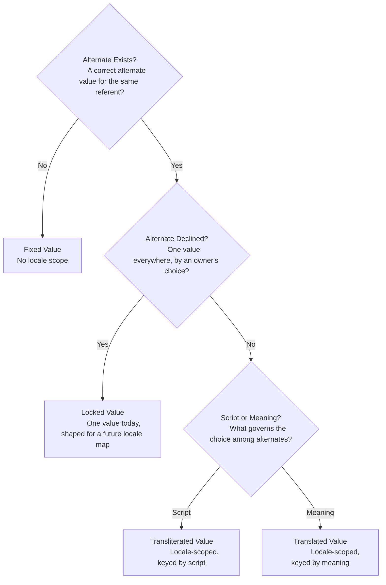

# Decision Tree: Placement for Value-to-Language Relationships

Version: 0.1.0
Status: Draft
Style Guide: style-guide--plain-language-for-general-audiences

## Abstract

This document gives a decision procedure, as a clickable flowchart, for where a configuration or accessibility variable should be stored, using the four value relationships defined in *Vocabulary and Definitions: Value-to-Language Relationships*, fixed, locked, transliterated, and translated. It asks three questions in order; each answer either continues to the next question or reaches one of the four relationships and its placement rule. It does not redefine the four relationships, only tests for them and states where each belongs, the fuller definitions live in the vocabulary document, and the open placement questions this tree surfaces, most notably that `site.yaml`'s `name` has no locale-map shape yet, are tracked in `adr--fact-and-expression-locale-scope-of-variables`. Pattern values are out of scope for this tree: a pattern is not itself an answer to the alternate-exists test, so apply this tree separately to a pattern's frame wording and to each value it embeds; see the vocabulary document's Pattern value section.

## Placement Decision Tree

### Alternate Exists?
Ask, for this value, whether a different string could still correctly identify the same referent. If changing the value would change what is identified rather than how it is expressed, there is no alternate to ask about further, go to [Fixed Value](#fixed-value). If a correct alternate could exist, continue to [Alternate Declined?](#alternate-declined).

[Return to the chart](#placement-decision-tree)

#### Fixed Value
No correct alternate exists for the referent, so store the value once, with no locale scope, in the brand or template layer that owns it, `brand.yaml`, `fonts.yaml`, or a non-mapped field in `site.yaml`. See `vocabulary--value-language-relationships-v0-1-0.md#fixed-value` for the full definition.

[Return to the chart](#placement-decision-tree)

#### Alternate Declined?
A correct alternate exists. Ask whether an owner has deliberately chosen to use one value everywhere rather than vary it. If yes, go to [Locked Value](#locked-value). If no, continue to [Script or Meaning?](#script-or-meaning).

[Return to the chart](#placement-decision-tree)

##### Locked Value
The alternate is declined by choice, so today's value can live in the brand layer as one string, the same as a fixed value, but the choice is revisable. Author it in the shape already used for `tagline`, `description`, and `logos.alt` in `site.yaml`, one string or a map keyed by locale, so a future locale that needs the declined alternate has somewhere to put it without restructuring the file. See `vocabulary--value-language-relationships-v0-1-0.md#locked-value` for the full definition.

[Return to the chart](#placement-decision-tree)

##### Script or Meaning?
A correct alternate is actually used somewhere. Ask what governs the choice among alternates: a script or transcription convention, with the referent unchanged, or the preservation of meaning, with wording expected to differ. The first is [Transliterated Value](#transliterated-value); the second is [Translated Value](#translated-value).

[Return to the chart](#placement-decision-tree)

###### Transliterated Value
The referent stays fixed but its written form legitimately varies by script or convention, so the value needs a locale-scoped store keyed by locale or script, the same shape as a translated value, even though meaning is not what is varying. `site.yaml`'s `name` has no such store today, see the open questions in `adr--fact-and-expression-locale-scope-of-variables-v0-1-0.md`. See `vocabulary--value-language-relationships-v0-1-0.md#transliterated-value` for the full definition.

[Return to the chart](#placement-decision-tree)

###### Translated Value
Meaning must survive and wording is expected to differ by locale, so the value belongs in a language root or its equivalent locale-scoped store, `src/_locales/<code>.json`, or a locale-keyed map in `site.yaml`. See `vocabulary--value-language-relationships-v0-1-0.md#translated-value` for the full definition.

[Return to the chart](#placement-decision-tree)

## License

This document, *Decision Tree: Placement for Value-to-Language Relationships*, by **Christopher Steel**, with AI assistance from **Claude (Anthropic)**, is licensed under the [GNU Affero General Public License v3.0 or later](https://www.gnu.org/licenses/agpl-3.0.html).

## Changelog

| Version | Status | Notes |
| --- | --- | --- |
| 0.1.0 | Draft | Initial draft; a clickable Mermaid decision tree classifying a variable as fixed, locked, transliterated, or translated through three questions, with placement rules for each and a return link back to the ADR's open questions for the two known gaps |
